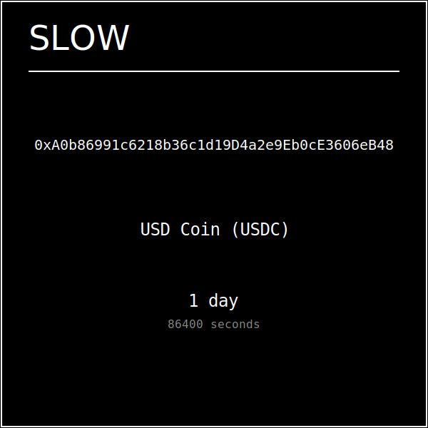
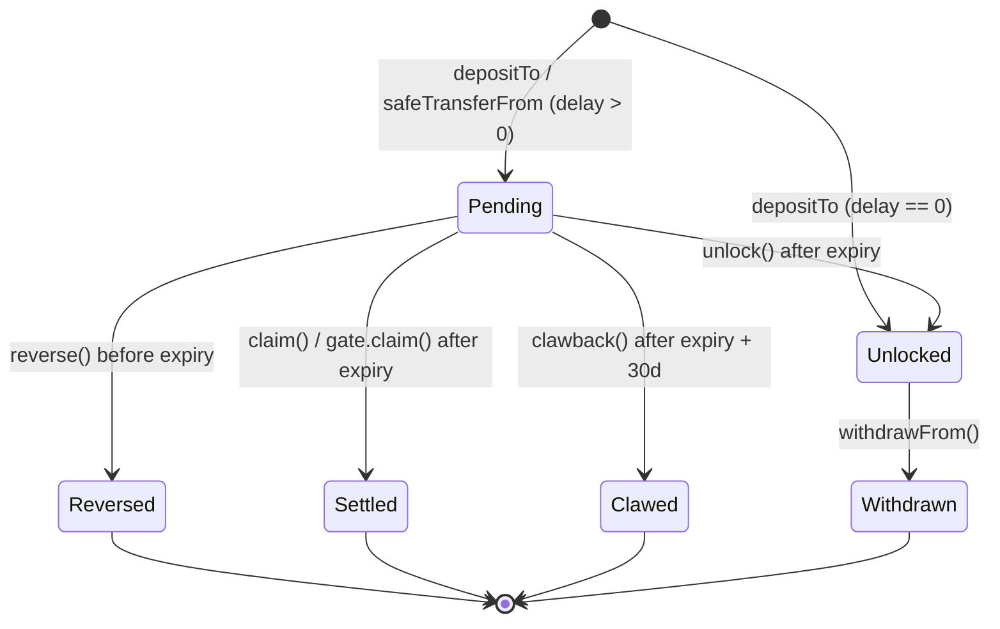
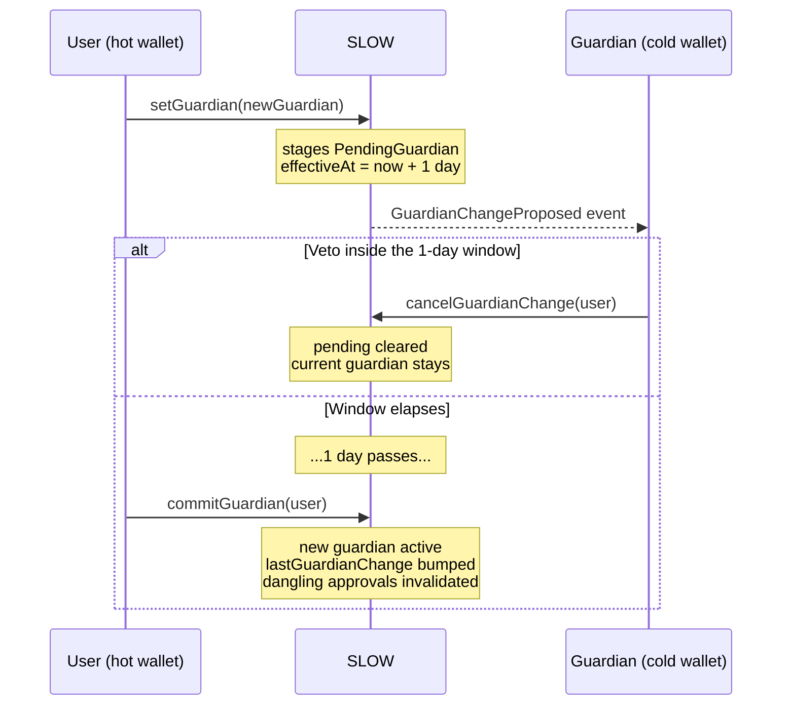
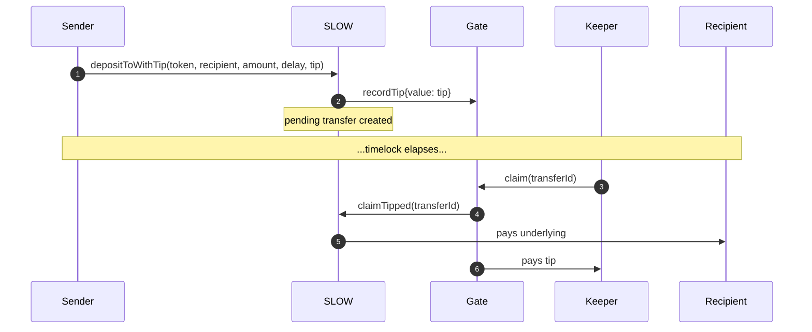

# [SLOW](https://github.com/z0r0z/slow)  [](https://opensource.org/license/agpl-v3/) [](https://docs.soliditylang.org/en/v0.8.34/) [](https://getfoundry.sh/)

## What is SLOW?

SLOW is an ERC-1155 wrapper around ETH and ERC-20 tokens that adds two opt-in safety mechanisms to every transfer:

1. **Timelock** — recipients have to wait before they can extract the underlying.
2. **Guardian** — an optional cosigner who must approve every outflow.

Wrap once, then send, hold, and reverse with safety rails. Any token, any delay, any time.

## Try it

- **Use it:** https://slow.wei.limo/ — the document `SLOW.html()` returns, nothing else
- **Contract:** [`0x000000006513B7821171C8447ec7ECdfa3b956Fd`](https://contractscan.xyz/contract/0x000000006513B7821171C8447ec7ECdfa3b956Fd) — the same address on Ethereum, Base and Robinhood Chain
- **Read the dapp yourself:** one `eth_call` to `html()` on that address returns the whole thing. Or fetch it from the page contract directly at https://0x6e2ca0ebf103fb2a2a7ebe2cb12f7de3a88bdcbc.w4eth.io/
- **Integrate it:** [`sdk/`](./sdk) — a zero-dependency SDK for web3 apps, wallets, and dapps (optional viem/wagmi + React layers), plus an [agent skill](./sdk/skills/slow) (`SKILL.md` + JSON CLI).

There is no build to trust and no server to compromise: the page is bytes in
contract storage, `SLOW.page` is `immutable`, and `manifest.json` pins the
SHA-256 so anyone can check the served document against the chain.

### Deployed

Production on three chains since 2026-09-05. One build, one address per
contract, identical everywhere.

| contract | address | runtime | role |
| --- | --- | --- | --- |
| `SLOW` | [`0x000000006513B7821171C8447ec7ECdfa3b956Fd`](https://etherscan.io/address/0x000000006513B7821171C8447ec7ECdfa3b956Fd) | 24,466 B | the protocol |
| `SlowPage` | [`0x6e2ca0EbF103fb2a2A7EBE2Cb12f7DE3A88BDCbc`](https://etherscan.io/address/0x6e2ca0EbF103fb2a2A7EBE2Cb12f7DE3A88BDCbc) | 3,827 B | serves the dapp |
| `SlowArrival` | [`0x9F8D89D298caBDC0D64cbA3888D0DA85Dc95097f`](https://etherscan.io/address/0x9F8D89D298caBDC0D64cbA3888D0DA85Dc95097f) | 4,916 B | keeps the reverse across a bridge |
| `SlowRelay` | [`0xC58C217791E397550492c4F84a6995Db60aDE2da`](https://etherscan.io/address/0xC58C217791E397550492c4F84a6995Db60aDE2da) | 10,598 B | escrowed fast transfers |
| `SlowLens` | [`0xC9c4a3d3Dd3714B08b2138080F1D143585531d4D`](https://etherscan.io/address/0xC9c4a3d3Dd3714B08b2138080F1D143585531d4D) | 5,918 B | batched reads |
| `SLOWGate` | [`0x76D1956b3BE7c0D09A16dE00DcE9B6f54ef28D34`](https://etherscan.io/address/0x76D1956b3BE7c0D09A16dE00DcE9B6f54ef28D34) | 1,808 B | custodies keeper tips |

Deployed through CreateX with sender-prefixed, chain-independent salts, so the
address comes from deployer and salt alone. `SlowRelay.receiveRelay` depends on
that: it authenticates a cross-chain proof by checking the origin equals its own
address. `SLOWGate` is created by `SLOW`'s constructor at a fixed CREATE2 salt,
so it follows `SLOW` wherever it lands.

**No admin.** `SLOW`, `SlowArrival`, `SlowRelay` and `SlowLens` have no owner at
all. The only privileged role in the system is `SlowPage` stewardship, which
decides who may append the *next* page version — and the served page does not
follow `successor`, so it cannot reach anyone already using this one.
`SLOW.page` is `immutable`, so what `SLOW.html()` returns is fixed permanently.

Verified on Etherscan for Ethereum and Base, and on Sourcify for all three —
17 of 18 exact matches. The exception is `SlowArrival` on Robinhood Chain, where
Sourcify cannot reconstruct creation bytecode for a CREATE3 deployment; the
runtime is byte-identical on all three chains and the same source is an exact
match on the other two, so the attestation is missing, not the correspondence.
[`deploy/verify-4663/`](./deploy/verify-4663) has everything prepared for a
manual submission.

```
node scripts/watch.mjs      # runtimes, wiring, stewardship, on all three chains
node scripts/pending.mjs    # anything owed across the bridges, and whether it is collectable
```

### Bridging

Native ETH, Ethereum to either L2, in one transaction. The dapp builds a
`SlowArrival.arrive` call and delivers it through the canonical bridge:

| route | stack | how the sender is recovered |
| --- | --- | --- |
| Ethereum → Base | OP Stack | arrives unaliased; the sender is its own origin |
| Ethereum → Robinhood Chain | Arbitrum Nitro | arrives aliased; origin comes from a hint checked against the alias |

Without `SlowArrival` the second route has no reverse at all: Nitro aliases every
retryable sender including EOAs, so `pt.from` would be an address with no key on
either chain. `SlowArrival` becomes the depositor, recovers who the deposit was
really for, and hands the reverse and clawback rights back to them.

Two paths are deliberately closed. The dapp always sends `bounty = 0`, which puts
an EIP-7702 hazard in the deployed `arrive` out of reach. And the Arbitrum route
is refused for any sender not *provably* an EOA, because
`Inbox.createRetryableTicket` aliases both refund addresses when they hold L1
code — a smart account would have its refunds stranded. Unknown counts as closed.

**Proven on mainnet, not on forks.** Four arrivals across both stacks, every one
attributing `originOf` to the true L1 sender, from both a plain EOA and a 7702
smart account. On Base the round trip was completed: arrived, then the recovered
sender called `SlowArrival.reverse` and the ETH came back. `SlowRelay` has been
exercised too — an intent opened on Base was found, priced, filled on Robinhood
and proved by the relayer in [`relayer/`](./relayer), unprompted. Hashes are in
`manifest.json` under `bridge.proven`.

L2→L1 exits are not in the dapp. They work, and
[`scripts/opprove.mjs`](./scripts/opprove.mjs),
[`opfinalize.mjs`](./scripts/opfinalize.mjs) and
[`arbexecute.mjs`](./scripts/arbexecute.mjs) drive them, but each needs a second
transaction days later — `scripts/pending.mjs` says when.

### Operating and recovery

**[Operating rules](./deploy/OPERATING-RULES.md)** — eight rules that keep the
deployed contracts safe without changing them. Three matter to anyone
integrating directly: an L2→L1 `arrive` carries no bounty, relayers fill from an
EOA, and relay senders are EOAs. Breaking one costs the integrator.

**[Admin console](./admin/index.html)** — one self-contained file, no build step,
no dependencies, for what the on-chain page does not cover: stewardship
handover, deployment health checks, the relayer intent lifecycle, and
`SlowArrival.claimRescue`. That last one matters — a bridged arrival that cannot
be deposited credits `rescue[origin]` instead of reverting, because reverting
inside an OP withdrawal destroys the message permanently, and nothing in the
served dapp claims it back. `test/admin.test.mjs` checks its hard-coded
selectors against the compiled ABIs, so a renamed function fails a test rather
than a steward's transaction.

**[relayer/](./relayer)** — the live half of `SlowRelay`, a background worker
that watches all three chains, fills from its own inventory and collects the
escrow. Dry run unless `RELAYER_KEY` is set, and bounded by `MAX_FILL_WEI` even
when live.

The page lives in `SlowPage` as seven data contracts reassembled by `html()`;
`w4eth.io` resolves that over the web for convenience, but the dapp can be
reconstructed by anyone calling `html()` directly. This is the [contract-hosted-app](./erc-draft_contract_hosted_app.md) pattern (draft ERC-8244): a single `html()` view returning a self-contained document, fetchable with one `eth_call`.

This repo ships its own resolver in [`gateway/`](./gateway) so you can host it yourself. It's a zero-dependency Node server (`node gateway/server.js`) that reads the target contract from the leftmost DNS label of `<0xADDRESS>.<yourdomain>`, makes one `eth_call` to `html()`, and serves the decoded document. It round-robins a pool of keyless public mainnet RPCs and fails over on any transient error, so it boots with no configuration; set `RPC_URL` (comma-separated) to put your own endpoints first. `index.html` is a client-only variant of the same resolver.

## Networks

The dapp is a portal, not a single-chain page. SLOW sits at the same canonical
address on every chain it is deployed to, so the address is not per-chain — what
differs is the code at it, the token set, and the surrounding infrastructure.

| | Ethereum | Base | Robinhood Chain |
| --- | --- | --- | --- |
| chain id | 1 | 8453 | 4663 (`0x1237`) |
| Multicall3 | canonical | canonical | canonical |
| Permit2 | canonical | canonical | canonical |
| CreateX | canonical | canonical | canonical |
| `.eth` / `.wei` / `.gwei` | resolves | **does not** | **does not** |
| assets | ETH · USDC · USDe · cbBTC<br>wstETH · WBTC · USDT · BOLD | ETH · USDC · USDe · cbBTC<br>wstETH · cbETH · USDT · AERO | ETH · USDG · USDe · cbBTC<br>NVDA · SPY · SPCX · GME |

Slots 1, 3 and 4 hold literally the same asset on all three chains — ETH, USDe,
cbBTC — and Base matches mainnet on 2, 5 and 7 as well. USDe is at one address
on Base and Robinhood Chain, cbBTC at one address on Base and mainnet: both were
deployed deterministically.

Two consequences are baked into the page:

**Names always resolve on mainnet.** WNS is absent on 4663, and the ENS registry
is present at its canonical address but *empty* — asking it to resolve `.eth`
returns the zero address rather than reverting. A dapp that resolved against the
active chain would not fail loudly there; it would tell the reader that a valid
name does not exist. So ENS and WNS reads are pinned to chain 1 unconditionally,
whichever chain is being spent on.

**Reads never go to a wallet parked elsewhere.** A wallet on mainnet asked to
`eth_call` chain 4663 answers with mainnet's state, silently and wrongly. The
page uses the wallet only when its chain matches the chain being read, and that
chain's public pool otherwise — which is also what lets it read the chain it is
not currently transacting on.

Switching is a portal, not a reload: everything cached per deployment is
dropped, the name cache is not. Sending on a chain the wallet does not know
falls back from `wallet_switchEthereumChain` to `wallet_addEthereumChain`.

## Why use SLOW?

- **Reverse mistakes.** Sent to the wrong address? Cancel before the timelock expires.
- **Buy time on a key compromise.** Funds in a pending transfer can't be extracted until the timelock elapses — long enough for an issuer freeze (USDC, USDT) or your own response.
- **Cosign sensitive transfers.** Set a guardian (a cold wallet, a trusted friend) to approve every outflow.
- **Sponsor delivery.** Attach a tip alongside the deposit and let any keeper push the funds — the recipient never needs ETH for gas.
- **Recover dead sends.** A 30-day clawback window catches transfers to lost or never-claimed addresses.

## How it works

### Wrap → wait → settle

Each SLOW token is an ERC-1155 position whose id encodes both the underlying token and a timelock delay. Every account has a wrapper balance and a separate per-id `unlockedBalance`. Outflows draw only from `unlockedBalance`; the timelock is the bridge between the two.

```
| 96 bits  |        160 bits      |
|  delay   |    token address     |     ← token id (delay in seconds, 0x0 for ETH)
```

A `depositTo` mints the wrapper to the recipient but parks the credit in a `pendingTransfer` until the timelock expires. After expiry the recipient (or an operator) settles. Before expiry the sender can reverse. Long after expiry, if no one settled, the sender can clawback.



*Every position renders its own SVG via `uri(id)` — above is the exact output for a 1-day USDC lock. See [`assets/render/`](./assets/render) for the source SVG.*

### Lifecycle



### Windows

```
            t₀                              expiry              expiry + 30d
   ─────────●─────────────────────────────────●───────────────────●────────────►
                ←────── reverse() ──────→     ←──── unlock() / claim() ───────→
                  sender's recovery window     recipient (or operator) settles
                                                                   ←─ clawback() ─→
                                                                    sender's last resort
```

Reverse and clawback are mutually exclusive: reverse is a pre-expiry primitive, clawback is post-expiry-plus-30-days, and any settlement (`unlock` / `claim`) in between disables both.

## Use cases

### 1. Reversible payments

Send with a delay. Bob sees the wrapper immediately but can only extract the underlying after the timelock. Alice has the full window to `reverse` if she catches an error.

### 2. Hot-wallet hardening

Wrap funds you hold long-term with a delay. A stolen key cannot drain the underlying for the full window — buying time for an issuer freeze (USDC, USDT) or for you to act.

### 3. Self-2FA via guardian

Designate a separate cold wallet as your guardian. Every outflow then requires the cold wallet's `approveTransfer`. Rotating an active guardian stages a 1-day veto window — a stolen key cannot quietly remove the guardian, because the cold wallet sees `GuardianChangeProposed` and calls `cancelGuardianChange`.



### 4. Sponsored / gasless delivery

Use `depositToWithTip` to attach an ETH tip alongside the deposit. Any keeper can call `gate.claim(transferId)` after expiry to push the funds; the keeper takes the tip. The recipient never needs gas. If the transfer cleared by a non-gate path (recipient `unlock` or direct `claim`, sender `reverse`, sender `clawback`), the depositor recovers the tip via `gate.refundTip`.



### 5. Lost-recipient recovery

If you send to an address that never claims (compromised key, dead wallet), `clawback` returns the funds to you 30 days after expiry — provided the transfer is still pending.

### Holding SLOW long-term: fuse vs. vault

A pure timelock is a **one-shot fuse, not a perpetual lock.**

The delay is encoded in the token id, so it governs *wrapper* moves: a
`safeTransferFrom` of a delayed id re-locks at the destination and stays reversible
for the whole delay. It does **not** govern leaving the wrapper. `withdrawFrom` burns
an unlocked balance and pays the underlying out in the same transaction — no delay, no
pending entry, nothing to `reverse`. So once `delay` expires on a self-deposited
position, anyone holding the key extracts it: one tx via `claim`, or `unlock` then
`withdrawFrom`. Re-wrapping on each expiry is a treadmill, not a vault. **A timelock
alone buys detection time, not custody.**

To hold SLOW long-term as a vault, pair the delay with a **guardian** — that is the
durable second factor. With a guardian set every outflow needs the cosigner:
`withdrawFrom` and `safeTransferFrom` are approval-gated, and `claim` reverts outright
with `ClaimBlockedByGuardian`, so a guarded account has no one-step exit at all and must
go `unlock` → `withdrawFrom` into the gate. A fully compromised hot wallet cannot
extract the wrapped underlying.

The gate keys on `from`, not `msg.sender`, so an operator granted `setApprovalForAll`
cannot route around it — and neither can `SlowRelay`, which pulls user funds through
`SLOW.safeTransferFrom`. What a guardian does *not* gate is `unlock`, `reverse` and
`clawback`, and it does not need to: none of them move value out of the wrapper.

Why pair the delay with the guardian, when the guardian gates zero-delay ids too? They
catch different mistakes. `revokeApproval` retracts a mistaken approval *before* it
lands; a delayed id means an approval that already landed is still reversible for the
length of the delay.

## Functions

### Deposit

| Function | Purpose |
| --- | --- |
| `depositTo(token, to, amount, delay, data)` | Wrap and create a pending transfer (or credit spendable balance immediately if `delay == 0`). |
| `depositToWithTip(token, to, amount, delay, tip, data)` | Same, plus a relayer tip held by the gate. Requires `delay != 0`, `tip != 0`, `tip <= type(uint96).max`. |
| `depositToWithPermit(token, to, amount, delay, data, deadline, v, r, s)` | EIP-2612 deposit — approval and wrap in one transaction. ERC-20 only. |
| `depositToWithTipAndPermit(token, to, amount, delay, tip, data, deadline, v, r, s)` | Same, with a tip; `msg.value` is the tip. |
| `permitSelf(token, amount, deadline, v, r, s)` | Raise this contract's allowance by signature and nothing else, for composing with `multicall`. |

Deposits are never guardian-gated — a guardian vetoes outflows, and a deposit is money
coming in.

### Settle / move

| Function | Purpose |
| --- | --- |
| `unlock(transferId)` | Recipient or operator: park an expired pending into `unlockedBalances[to]`. |
| `claim(transferId)` | Recipient or operator: one-step settle to underlying. Reverts when `to` has a guardian. |
| `claimTipped(transferId)` | Gate only: the sponsored form of `claim`, used when a tip was posted. Same guardian block. |
| `withdrawFrom(from, to, id, amount)` | Burn unlocked wrapper and pay underlying. **Undelayed and irreversible** — the id's delay does not apply to the raw exit. Guardian-gated if `from` has one. |
| `safeTransferFrom(from, to, id, amount, data)` | Move unlocked wrapper. Re-locks if id has a delay; guardian-gated if `from` has one. |
| `reverse(transferId)` | Sender or operator: cancel a pending transfer before expiry. |
| `clawback(transferId)` | Sender or operator: recover a pending transfer 30 days past expiry. |
| `forgetInbound(transferId)` | Drop a row from your own inbound index. Touches the index only — no value moves, and the transfer still settles by id. |

### Guardian

| Function | Purpose |
| --- | --- |
| `setGuardian(newGuardian)` | First-time set is immediate; rotating an active guardian stages a 1-day veto window. |
| `cancelGuardianChange(user)` | User or active guardian: veto a pending rotation during the window. |
| `commitGuardian(user)` | User or the sitting guardian only: finalize a rotation after the window. Not permissionless — see below. |
| `approveTransfer(from, transferId)` | Guardian only: approve a precomputed transfer or withdrawal id. |
| `revokeApproval(from, transferId)` | Guardian only: retract a single approval. |
| `wardsOf(guardian)` / `wardCount` / `wardsAt(guardian, start, count)` | Reverse index: the accounts a guardian guards, so a cosigner is shown its wards instead of typing them in. |
| `guards(guardian, ward)` | O(1) membership check on that index. |
| `forgetWard(ward)` | Guardian drops a row from its own ward index. Index-only; the guardianship itself is unaffected. |

`commitGuardian` is deliberately **not** permissionless. A late abort works by proposing
a different guardian and cancelling inside the new window; with an open commit, the
guardian being installed could watch the mempool, front-run that abort, and become the
sitting guardian with a legitimate veto over every later rotation. Restricting it to the
two parties the change is between costs nothing — either can still land it once the
window passes.

### Gate (sponsored delivery)

The gate is a CREATE2-deployed `claim`-only operator. Approve via `setApprovalForAll(slow.gate(), true)` to opt into keeper-driven settlement.

| Function | Purpose |
| --- | --- |
| `gate.claim(transferId)` | Settle one transfer; pay tip if any. Without a tip, requires recipient operator approval on the gate. |
| `gate.claimMany(ids[])` | Batch settle with **per-id isolation** — each id runs through a `try` capped at 250,000 gas, and a failing id is skipped rather than reverting the batch. |
| `gate.refundTip(transferId)` | Depositor recovers the tip after the transfer cleared by a non-gate path. |

> **Note — `claimMany` natspec.** The `@notice` on `claimMany` in the deployed source
> still reads "Atomic batch settlement; the whole call reverts on the first failure."
> That describes an earlier revision; the deployed body isolates each id behind a
> gas-capped `try/catch`, exactly so an honest recipient front-running the batch with
> their own `unlock` cannot destroy it. The comment cannot be corrected in place:
> `bytecode_hash` is `ipfs`, so editing any comment in `src/SLOW.sol` moves the trailing
> metadata hash and breaks the byte-exact verification of the live contract. Trust the
> body and this table over that one comment.

### View helpers

| Function | Purpose |
| --- | --- |
| `predictTransferId(from, to, id, amount)` | Hash of the next outbound transfer / transfer-approval preimage. |
| `predictWithdrawalId(from, to, id, amount)` | Hash of the next withdrawal-approval preimage (distinct op-type). |
| `predictDepositId(from, to, id, amount)` | Hash of the pending entry the next delayed `depositTo` will create. Runs off `nonces`, not `guardianNonces`. |
| `canReverseTransfer(transferId)` | `(canReverse, reason)` preflight. |
| `isGuardianApprovalNeeded(user, to, id, amount)` | Does the next `safeTransferFrom` need cosign? |
| `isWithdrawalApprovalNeeded(user, to, id, amount)` | Does the next `withdrawFrom` need cosign? |
| `getOutboundTransfers(user)` / `getInboundTransfers(user)` | All pending transfer ids. |
| `outboundTransferCount` / `outboundTransferAt` (and inbound equivalents) | Paginated access — preferred for on-chain consumers. |
| `encodeId(token, delay)` / `decodeId(id)` | Token-id helpers. |
| `html()` | Returns the dapp document, served from the immutable `page` contract (`SlowPage`), which holds it in SSTORE2 chunks. |

## Technical details

### Transfer id

```solidity
keccak256(abi.encodePacked(
    from, to, id, amount,
    counter[from], lastGuardianChange[from], opType
))
```

There are three op types and **two** counters:

| op | `opType` | counter |
| --- | --- | --- |
| `safeTransferFrom` | `0` | `guardianNonces[from]` |
| `withdrawFrom` | `1` | `guardianNonces[from]` |
| delayed `depositTo` | `2` | `nonces[from]` |

The op byte keeps the three id spaces disjoint, so a guardian approval for one op cannot
be consumed as another. `lastGuardianChange[from]` is mixed in so a guardian rotation
invalidates every dangling approval at once.

**Why the counters are split.** Deposits are not guardian-gated. If approvals ran off the
same counter a deposit advances, the compromised key a guardian exists to defend against
could void every standing approval for 1 wei plus gas — and batch ten of them per
transaction through `multicall`. The guardian would survive while the rescue it existed
to authorise could never land. Only operations a guardian actually gates move
`guardianNonces`.

### Op-type split

Guardian approvals come in two flavors with distinct preimages:

- **Transfer approval** — for `safeTransferFrom` (use `predictTransferId`).
- **Withdrawal approval** — for `withdrawFrom` (use `predictWithdrawalId`).

Approving one will not satisfy the other. Guardians must still verify intent off-chain.

### Multicall and SVG

- `Multicallable` (Solady) lets clients batch read/write calls; the inherited implementation reverts on nonzero `msg.value`, so payable deposits cannot be smuggled into a batch to drain the pool via `msg.value` reuse.
- Every id has a generated SVG render exposed via `uri(id)` — useful for marketplace and wallet display.

## Security considerations

- **No admin, no upgrades, no fees.** The contract has no owner, no pausable, and no upgrade path. Behavior is fixed at deployment.
- **Guardian veto window.** Rotating an active guardian stages a 1-day delay, and removal (`setGuardian(address(0))`) takes the same path — a stolen key cannot quietly drop the guardian. Either party can `cancelGuardianChange` during the window; after it, only `commitGuardian`, and only by the user or the sitting guardian. The window is the decision period, not an indefinite veto.
- **A *hostile* guardian can freeze you permanently. A *lost* one cannot.** The two cases are not alike and the difference decides how you pick a guardian. An actively hostile guardian refuses every approval *and* vetoes every rotation with `cancelGuardianChange`, indefinitely, for ~30,000 gas a time — no timeout, no escape hatch, and you cannot name yourself as the replacement (`InvalidGuardian`). That is permanent loss, and it requires having appointed an adversary. A lost or simply inactive guardian key is **recoverable**: propose the change, wait out the 1-day window nobody is alive to veto, and commit it yourself — `commitGuardian` accepts the user. `testRemoveGuardian` and `testGuardianChangeDelay` both land the rotation with the guardian never acting. So losing your cold wallet costs you a one-day wait, not the position. Appoint a guardian you trust; you do not have to fear merely losing it.
- **A guardian must be in place before compromise.** The first set (or a set after removal) is immediate; every change after that is staged 1 day. Setting a guardian is not a response to a theft in progress.
- **The reverse window is uncontested.** `reverse` requires `block.timestamp < ts + delay` and `unlock`/`claim` require `>=`, so the windows are strictly disjoint: a recipient cannot settle inside the sender's reverse window. The delay is guaranteed to the sender, not raced for.
- **Reverse is not a recovery primitive.** It is only available before expiry, and a reverse from a compromised key credits `unlockedBalances` back to that same compromised account. It relies on the sender's key being safe. On a *self*-deposit it protects nothing at all: sender and recipient are the same key.
- **The timelock does not gate the raw exit.** The delay lives in the token id and applies to `safeTransferFrom`. `withdrawFrom` is undelayed and irreversible. See *fuse vs. vault* above.
- **Clawback grace.** 30 days post-expiry, and only if the transfer is still pending. Recipient or any operator can `unlock` or `claim` during the grace window to settle and disable clawback.
- **Wallet display vs. spendability.** ERC-1155 wallets and marketplaces see the full wrapper balance, including amounts still in pending transfers. `unlockedBalances[user][id]` is the source of truth for what is actually spendable.
- **Reentrancy.** Transient-storage guard on every external entry point.
- **ERC-1155 deviations.** `safeBatchTransferFrom` is disabled; zero-amount transfers revert. `supportsInterface` still claims ERC-1155 — treat this as ERC-1155-derived rather than fully compliant.
- **Inbound-set spam.** Anyone can deposit dust to your inbound set. On-chain consumers should paginate via `inboundTransferCount` + `inboundTransferAt(i)` rather than calling `getInboundTransfers`.
- **Unsupported tokens.** Fee-on-transfer and rebasing tokens (e.g. stETH) break the wrapper's 1:1 accounting. Wrap rebasing assets to their non-rebasing equivalent (e.g. wstETH) before depositing.
- **Gate cannot redirect funds.** The `claim` path pins payout to `pt.to`; the gate has no path to `safeTransferFrom` or `withdrawFrom`. Keepers can only choose *when* to settle, not *where* funds go.

### Audits

Independent reviews of `SLOW.sol`. None identified a critical/high fund-loss path or an issue forcing a redeploy; each report carries inline maintainer responses recording the disposition of every finding.

| Date | Reviewer | Result | Report |
| --- | --- | --- | --- |
| 2026-04-29 | pashov-ai | No findings above the confidence threshold | [report](./assets/audit/slow-pashov-ai-audit-report-20260429-163652.md) |
| 2026-04-29 | Zellic V12 | 3 Low (unreviewed) — 1 false positive, 1 non-finding, 1 documented | [report](./assets/audit/slow-zellic-v12-audit-report-20260429-181500.md) |
| 2026-07-22 | GPT-5.6 Pro | 1 High, 2 Medium, rest Low/Info — all accepted or dapp-mitigable | [report](./assets/audit/slow-gpt-5.6-pro-audit-report-20260722-172206.md) |
| 2026-07-22 | OneDollarAudit | 8 findings, all Low/Info | [report](./assets/audit/slow-onedollaraudit-audit-report-20260722-192400.md) |
| 2026-09-04 | pashov-ai | Protocol pass alongside the bridge review below | [report](./assets/audit/slow-pashov-ai-audit-report-20260904-095600.md) |

The bridge contracts — `SlowOrigin`, `SlowArrival`, `SlowRelay`,
`SlowBridgeRegistry` — are newer and reviewed separately. Both passes ran before
anything was deployed, so every finding was fixable at the only price that is
ever cheap.

| Date | Reviewer | Result | Report |
| --- | --- | --- | --- |
| 2026-09-04 | pashov-ai | 11 findings, all fixed with regressions | [report](./assets/audit/slow-bridge-pashov-ai-audit-report-20260904-120000.md) |
| 2026-09-05 | Claude Opus 5 | 4 findings, all fixed; `PROOF_GRACE` closed by measurement | [report](./assets/audit/slow-bridge-claude-opus-5-audit-report-20260905-140000.md) |
| 2026-09-06 | Claude Opus 5 (adversarial) | No theft path in core or relay against the LIVE contracts; deployed bytecode verified identical to source | [report](./assets/audit/slow-adversarial-review-20260906.md) |

## Build & test

```sh
curl -L https://foundry.paradigm.xyz | bash && source ~/.bashrc && foundryup
forge build
bash scripts/test.sh          # forge + the node suites + the docs check
```

`forge test` alone works, but `scripts/test.sh` is the runner this repo relies
on. It recompiles the test files that bake in `type(...).creationCode` before
running — a stale artifact there fails on a change that could not have caused it,
and that has very nearly reverted a correct change — then runs the Node suites,
the page suite against the minified artifact that actually deploys, and the
deployment rehearsal.

`forge snapshot` for gas.

`forge fmt` formats `test/` and `script/` only. `foundry.toml` excludes every
deployed source, and the exclusion is load-bearing: solc hashes a contract's
source *and its imports* into the CBOR metadata appended to the runtime, so
reformatting one of those files moves the trailing hash and the bytecode on
chain stops matching the repo. The code still compiles and the tests still pass;
only Etherscan and Sourcify notice. Unignored, a single `forge fmt` would break
the verification of five deployed contracts across three chains.

`node scripts/syncdocs.mjs` regenerates `docs/src/README.md`, which is `forge
doc`'s copy of this file. `--check` is what `scripts/test.sh` runs.

Dapp tests run on vanilla Node — no NPM:

- `node test/page.test.mjs` — unit tests for `dapp/page.html`: keccak256, namehash, the ABI codec, the Multicall3 `aggregate3` encoder and decoder, exact-decimal units, EIP-712 domain separators, EIP-5792 capability probing, the chain registry, transfer status, and every selector.
- `node test/chainswitch.test.mjs` — the state that must not survive a chain switch. Dirties every field, switches across all six ordered chain pairs, and asserts the per-chain ones cleared while the chain-independent ones (the name cache, the connected account) survive. Offline.
- `node test/names.live.mjs` — name resolution against mainnet, and what it costs: forward resolution per TLD, reverse across all three registries, and a count of the JSON-RPC round trips each takes. Also asserts that name reads stay on mainnet while another chain is active.
- `node test/chains.live.mjs` — the chain registry against real nodes: each chain answers with the id it claims, Multicall3 is at the canonical address, every listed token reports the symbol and decimals the registry pins, and `.eth` resolves only on mainnet. Needs network; skips a chain cleanly if its RPCs are unreachable.
- `node test/slow_html.test.mjs` — the same for the frozen v1 artifact `SLOW.html`.
- `node test/slow_html.e2e.test.mjs` — end-to-end. Spawns `anvil`, deploys SLOW, drives the dapp's flow functions against the live contract, asserts on-chain state matches dapp state. Requires `anvil` on PATH and a current `forge build`.

Both HTML files are read in memory by their runners — never modified.

### The page pipeline

```sh
node scripts/serve.mjs          # localhost, real wallet, real transactions
node scripts/chunk.mjs          # -> out/chunkN.creation.txt
node scripts/address.mjs <deployer> --mine 0x000000
node scripts/verify.mjs         # the deployment, against the chain
```

`manifest.json` pins the page's byte length and SHA-256. Editing `dapp/page.html`
without editing the manifest fails every command, deliberately: a chunk set built
from a page nobody pinned is how a deploy stops matching its repo.

See [`deploy/SLOW-PAGE.md`](./deploy/SLOW-PAGE.md) for the CREATE3 deployment.

## Layout

```txt
dapp/page.html      — the dapp, one self-contained file (source of truth)
dapp/page.min.html  — what is deployed; scripts/minify.mjs output, same tests must pass
manifest.json       — release pin: byte length, SHA-256, deployed addresses, bridge proofs
admin/index.html    — standalone admin + recovery console (no build step, no dependencies)
src/
├─ SLOW.sol              — protocol contract (also defines SLOWGate)
├─ SlowPage.sol          — ERC-8244 / ERC-5219 page contract, N chunks, CREATE3
├─ SlowOrigin.sol        — recovers who is behind a cross-chain call, no bridge table
├─ SlowArrival.sol       — becomes the depositor so a bridged send keeps its reverse
├─ SlowRelay.sol         — escrowed fast transfers, settled by a relayer
├─ SlowLens.sol          — batched reads
├─ SlowBridgeRegistry.sol — optional route/address book (written, not deployed)
├─ SlowGuardianIndex.sol — guardian ward index
├─ SlowPermit.sol        — permit deposits
└─ SLOWv1.sol            — the previous protocol version
relayer/            — live SlowRelay worker (index.mjs) + failover RPC pool (rpc.mjs)
gateway/server.js   — self-hostable html() resolver; index.html is a client-only variant
scripts/
├─ watch.mjs        — re-check the live deployment on all three chains
├─ pending.mjs      — what the bridges still owe, and whether it is collectable
├─ opprove.mjs      — prove an OP withdrawal (storage proof vs the dispute game claim)
├─ opfinalize.mjs   — finalise one, naming both clocks when it is not ready
├─ arbexecute.mjs   — execute a Nitro L2→L1 message through the Outbox
├─ relayer.mjs      — the fill DECISION, imported by relayer/index.mjs
└─ chunk / minify / verify / address / serve — the page pipeline, driven by the manifest
deploy/
├─ OPERATING-RULES.md — eight rules that keep the deployed contracts safe
├─ SLOW-BRIDGE.md     — bridge deployment plan
├─ SLOW-PAGE.md       — CREATE3 deployment plan for the page
└─ verify-4663/       — prepared bundle for the one manual attestation
test/                 — forge suite + vanilla-Node tests (scripts/test.sh runs everything)
sdk/                  — integration SDK (zero-dep core + optional viem/wagmi + React)
├─ skills/slow/       — agent skill: SKILL.md + reference.md + slow.mjs (JSON CLI)
└─ examples/          — buildless browser, wagmi/React, keeper-bot
assets/audit/         — independent security reviews with inline maintainer responses
SLOW.html             — frozen v1, as deployed inside the v1 contract's html()
lib/                  — solady, forge-std
```

## Disclaimer

*These smart contracts and testing suite are being provided as is. No guarantee, representation or warranty is being made, express or implied, as to the safety or correctness of anything provided herein or through related user interfaces. The [reviews linked above](#audits) are AI-assisted and do not constitute a formal third-party security audit; as such there can be no assurance anything will work as intended, and users may experience delays, failures, errors, omissions, loss of transmitted information or loss of funds. The creators are not liable for any of the foregoing. Users should proceed with caution and use at their own risk.*

## License

See [LICENSE](./LICENSE) for more details.
